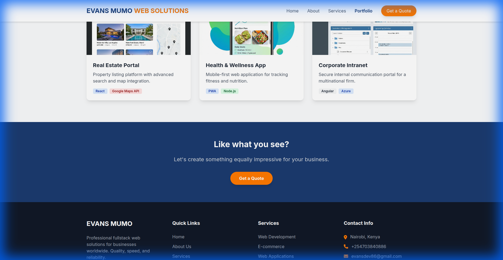
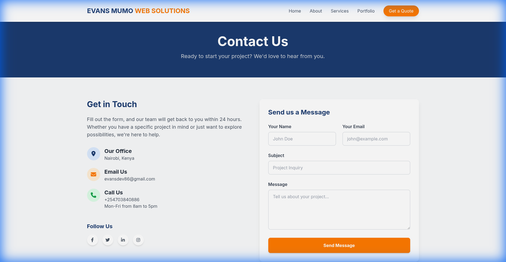

# Evans Mumo Web Solutions Website

This is the official website for Evans Mumo Web Solutions, a professional fullstack software development company.

## Project Structure

- `index.html`: Home page
- `about.html`: About Us page
- `services.html`: Services page
- `portfolio.html`: Portfolio page
- `contact.html`: Contact page
- `css/`: Contains `styles.css` (custom styles)
- `js/`: Contains `main.js` (interactivity)
- `images/`: Contains website assets
- `fonts/`: Web fonts (if downloaded locally, currently using Google Fonts)

## Technologies Used

## Screenshots

### Home Page


### Portfolio


### Contact Page


## Technologies Used

- **HTML5**: Semantic structure
- **Tailwind CSS**: Utility-first styling (via CDN for immediate deployment)
- **Vanilla JavaScript**: Lightweight interactivity
- **Font Awesome**: Icons
- **Google Fonts**: Typography (Inter)

## Deployment Instructions

### Option 1: Netlify (Recommended)

1.  Drag and drop the `evans-mumo-web-solutions` folder into the Netlify Drop area.
2.  The site will be live instantly.

### Option 2: Vercel

1.  Install Vercel CLI: `npm i -g vercel`
2.  Run `vercel` in the project directory.
3.  Follow the prompts to deploy.

### Option 3: GitHub Pages

1.  Push the code to a GitHub repository.
2.  Go to Settings > Pages.
3.  Select the `main` branch and `/` root folder.
4.  Save.

## Local Development

To run the site locally, simply open `index.html` in your browser.
For a better experience, use a local server:

```bash
npx serve .
```

## Customization

- **Colors**: Defined in `tailwind.config` script in the `<head>` of each HTML file and `css/styles.css`.
- **Content**: Edit the HTML files directly to update text and images.
- **Images**: Replace images in the `images/` folder.

## Contact Form Setup (Formspree)

To make the contact form work:

1.  Go to [Formspree](https://formspree.io/) and sign up for a free account.
2.  Create a new form and name it "Contact Form".
3.  Copy the **Endpoint URL** provided (e.g., `https://formspree.io/f/xyza...`).
4.  Open `contact.html` in your code editor.
5.  Find the `<form>` tag and replace `YOUR_FORM_ID` with your unique code from the URL.
    ```html
    <form action="https://formspree.io/f/YOUR_UNIQUE_CODE" method="POST">
    ```
6.  Save the file. Now, all submissions will be sent directly to your email.
